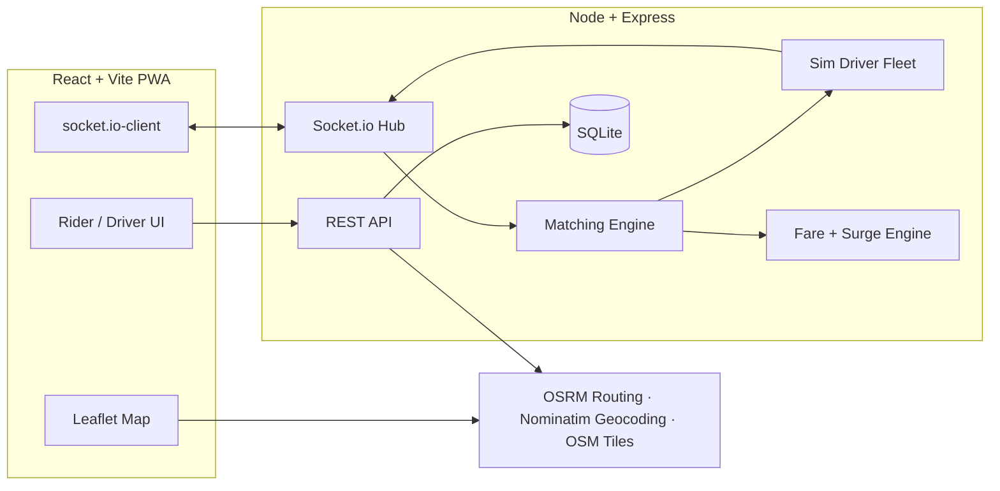

<div align="center">

# 🚗 zber

**A full-stack, real-time ride-hailing platform — an Uber-class experience built from scratch.**

[](https://zber.onrender.com)


</div>

---

## ✨ Try it now

**👉 [zber.onrender.com](https://zber.onrender.com)** — sign up as a rider, set a destination, and a driver picks you up and drives the route in real time. Works great on mobile: open in Safari/Chrome → *Add to Home Screen* to install it as an app.

> ⏳ Hosted on a free tier — if the app has been idle it takes ~30–45 seconds to wake up on first load.

**The demo is fully self-contained**: a simulated driver fleet spawns near your pickup, accepts your request, drives to you along real roads, and completes the trip — so you can experience the entire product with a single account. To try the driver side, sign up as a **Driver** in a second browser window, tap **GO**, and accept ride requests from your rider account.

## 🎯 Features

| Rider | Driver | Platform |
|---|---|---|
| 📍 Address search + tap-to-set pickup/destination | 🟢 Online/offline availability toggle | 🔐 JWT authentication, rider & driver roles |
| 🚕 3 ride tiers (ZberX / XL / Black) with live fare estimates | 📲 Incoming ride offers with 15s accept countdown | ⚡ Real-time GPS + status over WebSockets |
| 📈 Dynamic surge pricing | 🗺️ Full trip flow: arrive → start → complete | 🧠 Nearest-driver matching with timeout cascade |
| 🚗 Live driver tracking on the map | 💰 Earnings dashboard (today / week / all-time) | 🛣️ Real road routing (OSRM) + geocoding (Nominatim) |
| ⭐ Post-ride ratings & tips | 📊 Trip history with per-trip earnings | 🤖 Simulated driver fleet that drives real routes |
| 💳 Payment methods (mock) & ride history | | 📱 Installable PWA (offline shell, home-screen app) |

## 🏗️ Architecture



**How a ride happens:**
1. Rider requests → server prices the trip (road distance × tier rates × live surge) and opens a **matching session**
2. The matching engine offers the ride to the nearest idle driver; declines/timeouts cascade to the next-closest
3. On accept, both parties get live updates over WebSockets — driver GPS streams to the rider's map at 1Hz
4. Trip completes → fare lands in the driver's earnings, rider rates & tips, ratings aggregate onto the driver profile

**The sim fleet** makes the demo work solo: AI drivers spawn near demand, roam while idle, "think" before accepting, and drive OSRM road geometry to the pickup and destination — indistinguishable from real drivers to the client.

## 🛠️ Tech stack

| Layer | Choices | Why |
|---|---|---|
| Frontend | React 18, Vite, Leaflet, socket.io-client | Fast dev loop, imperative map control, typed event channels |
| Backend | Node, Express, Socket.io, better-sqlite3, JWT + bcrypt | Single deployable service; synchronous SQLite = zero-latency queries, no ORM overhead |
| Geo services | OSRM (routing), Nominatim (geocoding), OSM/CARTO (tiles) | Production-grade geo features with zero API keys — with graceful offline fallbacks |
| Deployment | Render (single web service), PWA manifest + service worker | One process serves API + WebSockets + static client |

## 🚀 Run locally

```bash
git clone https://github.com/xSwaraJx/zber.git
cd zber
npm install && npm run install:all
npm run dev          # backend :4000 + frontend :5173
```

Open http://localhost:5173 — that's it. No API keys, no environment setup, no external database.

```bash
npm run build && npm start   # production mode: everything on :4000
```

## 📁 Project structure

```
zber/
├── server/src/
│   ├── index.js      # Express + Socket.io bootstrap, static serving
│   ├── auth.js       # JWT auth, registration, roles
│   ├── rides.js      # Ride lifecycle REST API, earnings, payments
│   ├── matching.js   # Nearest-driver offer engine with timeout cascade
│   ├── sim.js        # Simulated fleet: spawning, roaming, route driving
│   ├── fares.js      # Tier pricing, haversine, surge model
│   ├── routing.js    # OSRM road routing with straight-line fallback
│   ├── sockets.js    # Presence, live GPS relay, offer accept/decline
│   └── db.js         # SQLite schema
└── client/src/
    ├── RiderHome.jsx   # Request flow: search → tiers → track → rate
    ├── DriverHome.jsx  # GO toggle, offer modal, trip actions
    ├── MapView.jsx     # Imperative Leaflet wrapper (markers, routes, fit)
    └── ...             # Auth, history, earnings, profile, PWA shell
```

## 📄 License

MIT © [Swaraj Gamare](https://github.com/xSwaraJx)
